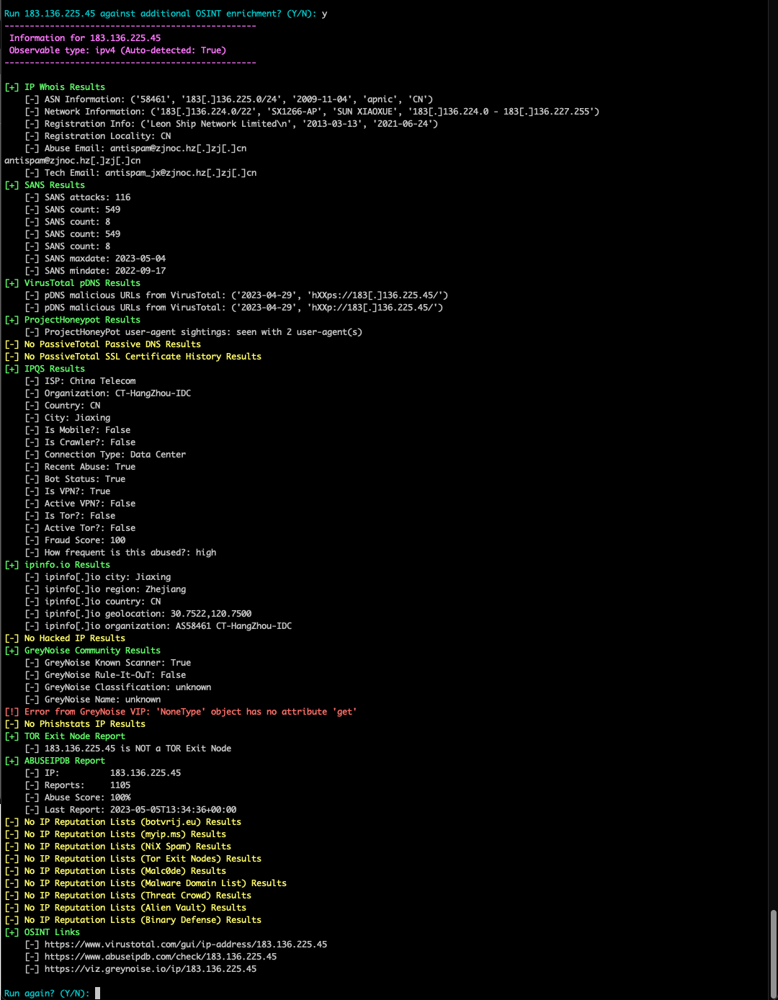
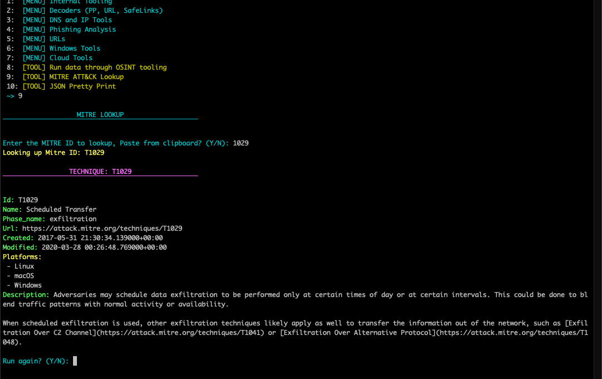
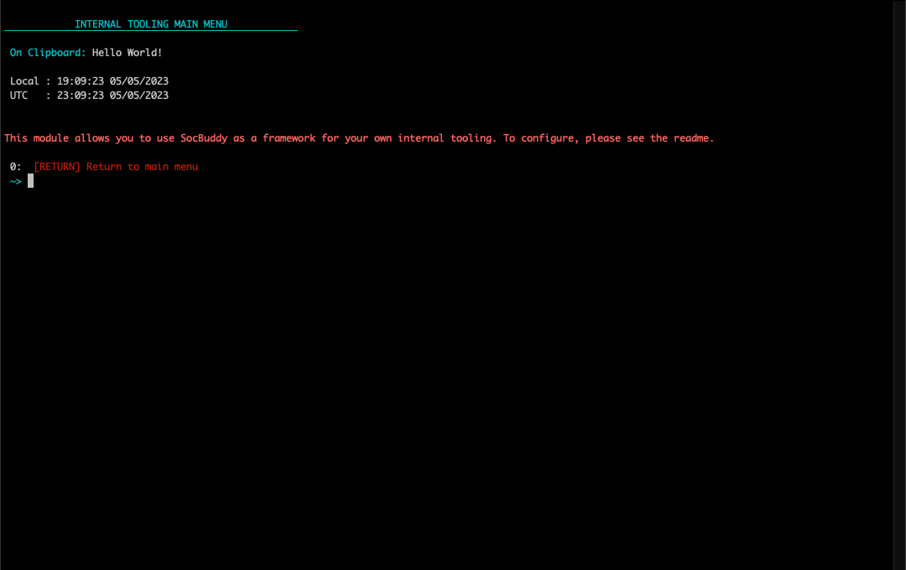

# Analysis Buddy

Analysis Buddy is an all-in-one tool for cybersecurity professionals, designed to make analysis easier by collecting frequently used tools together in an easy to use menu system. With Analysis Buddy, you can quickly and easily look up Indicators of Compromise (IOCs) against a variety of OSINT APIs. The tool also has the ability to search MITRE techniques and other useful lookups for quick reference while performing an investigation. 

## Installation

1. Clone the repository
2. Run `./setup.sh` to install the required dependencies. Mac and Linux is the only supported platform at this time.
3. Copy the config files located in `./config/config_examples` to `./config`
4. Rename the files to `config.yaml` and `machinae.yaml`
5. Edit configuration file with your API keys.
	1. If you don't have API access to a tool listed in the config, Analysis Buddy will prompt you that the key is missing.
	2. In `machinae.yaml`, you can enable tools by changing `default: False` to `default: True`
		1. Some of the machinae sources require you to enter an API key where it says 'CHANGEME'"
6. Run the tool with `./run.sh`

## Features
  
* The tool is built around [Hurricane Labs Machinae Project](https://machinae.hurricanelabs.com/). Machinae is a tool for collecting intelligence from public sites/feeds about various security-related pieces of data: IP addresses, domain names, URLs, email addresses, file hashes and SSL fingerprints. 

* Threat lists:  In `config/json_lookups/threat_lists`, I have a list of publicly available threatlists that I grabbed from various githubs and firebog. Threat lists of course aren't always accurate and need to be validated but when an IP or Domain that I run through the tool appears on one of these lists, its an extra datapoint to look at in my investigation. 

- AWS/GCP/Azure lookups: Analysis Buddy includes lookups for commonly used information from cloud providers like AWS, GCP, and Azure.

- MITRE Techniques: Analysis Buddy includes a function to return a MITRE Technique by its Technique ID, making it easy to look up information on specific techniques used in detections.

* Expandability: If you want to use your internal APIs and use Analysis Buddy as a framework, the "custom" module will allow you to develop your own functions and tooling separate from the "core" code of the tool.

* More to come! I plan to continue deving on this project because I use this tool daily in my analysis workflow. 

## Add your own internal tools

If you want to use your internal APIs or internal python tools and use Analysis Buddy as a framework, the `custom` folder will allow you to build in a .gitignored folder to keep the code separate from the "core" code of Analysis Buddy. 

### Menu System
Each menu in Analysis Buddy has two elements. 

*  A `menu()` function that includes what you to print to the console and the color of the menu item.
	* `analysisbuddy.menu_item(0, "Example", "menu")` 
		* The `option_type` variable determines the color of the menu item.
			* menu
			* tool
			* copy
			* link
			* goback
			* exit
* A `menu_switch(choice)` function that will collect the input and send you to your function. 

### custom Config
Just like the "core" code, there is a `.custom/config/example_config.yaml` example file. You will need to rename this file to `config.yaml` and add your APIs to that config file.  Once that is configured, uncomment `# customconfigvars = loadconfig.load_custom_config()` found in `custommenu.py` to load your config file. 

## Images
### Machinae

### MITRE Lookups

### Cloud Lookups

### Windows Tools

### DNS and IP Tools 

### Internal Tooling
